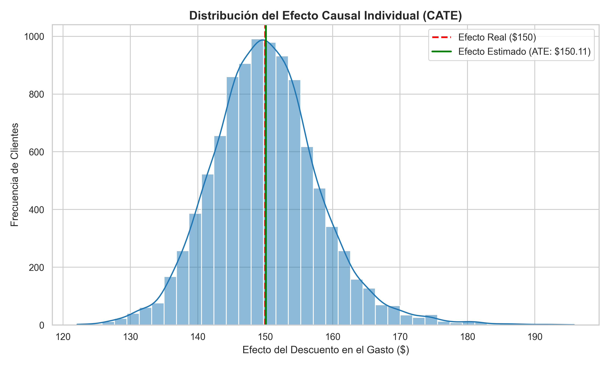
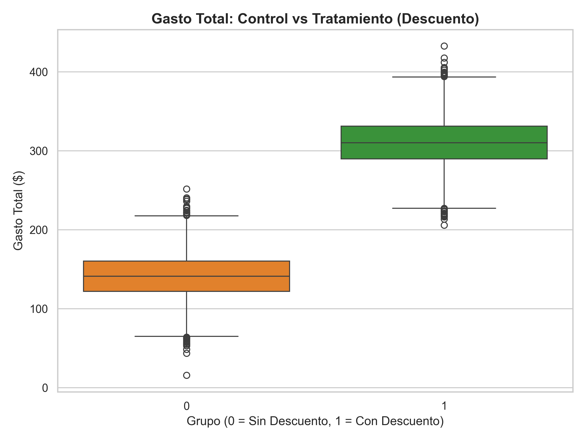

# Causal Inference for Pricing and Uplift Modeling 

Este proyecto demuestra cómo utilizar Inferencia Causal (mediante un enfoque de Meta-Learners, específicamente un **T-Learner con LightGBM**) para aislar el verdadero efecto de una campaña de descuentos sobre las ventas, separando la causalidad de la correlación (variables de confusión).

##  Impacto del Negocio y Resultados

El modelo logró aislar con éxito el Efecto Promedio del Tratamiento (ATE), demostrando que el incremento en ventas se debe a la campaña y no al sesgo histórico de los clientes.

### 1. Estimación del Efecto Causal (Uplift)

### 2. Comparación de Grupos (Control vs. Tratamiento)

##  Tecnologías y Arquitectura
* **Lenguaje:** Python
* **Librerías:** Pandas, NumPy, Scikit-Learn, LightGBM, Seaborn.
* **Diseño:** Código modular y orientado a objetos, listo para integración de pipelines e inyección de dependencias.